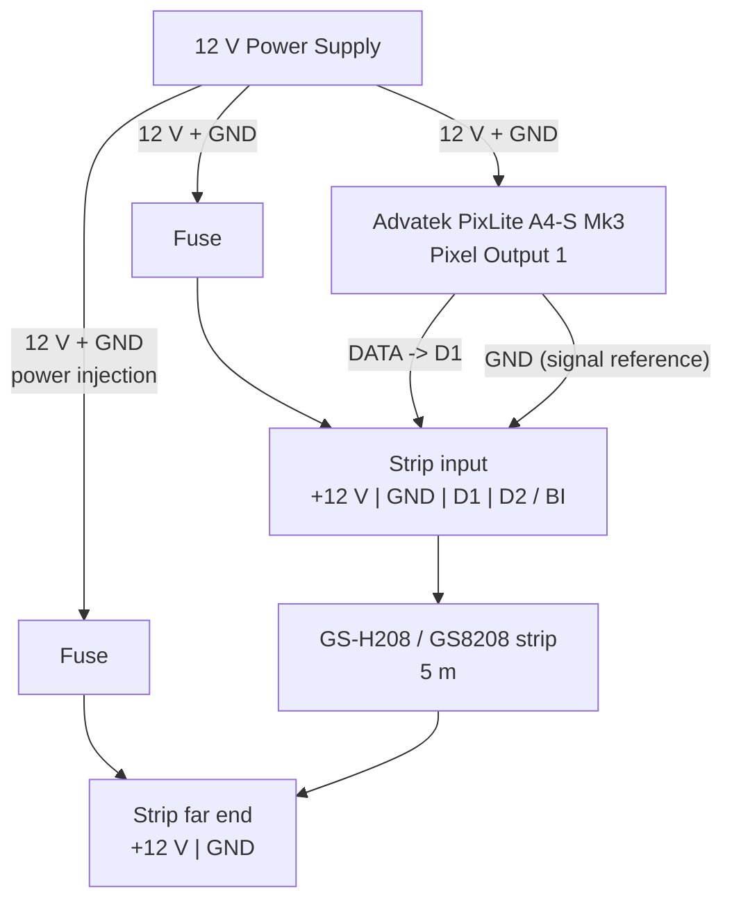

Kick - 22" d
Snare - 13
Tom 1 - 13
Tom 2 - 16


Picking a pixel type means a certain current draw per metre

Given the number of metres, we can woek out total current draw


Max Current per Output = 7A
Max power = 12W
Avg. 5.2m length per output -> 15W/m = 78W per output and 6.5A per output

![[LEDrums.excalidraw]]

# Diagram




# Config Json
2026-03-23

```json
{
  "version": 1,
  "units": "mm",
  "global": {
    "ledDensityPxPerM": 120,
    "hoopCount": 4,
    "defaultHoopSpacingMm": 50
  },
  "drums": [
    {
      "id": "kick",
      "label": "Kick",
      "color": "#5bbcff",
      "diameterIn": 21,
      "hoopSpacingMm": 120,
      "localSpinDeg": 270,
      "startAngleDeg": 0,
      "origin": {
        "x": 0,
        "y": 0,
        "z": 0
      },
      "rotation": {
        "x": 90,
        "y": 0,
        "z": 0
      },
      "effectOriginLocal": {
        "x": 0,
        "y": 0,
        "z": 0
      }
    },
    {
      "id": "snare",
      "label": "Snare",
      "color": "#72d572",
      "diameterIn": 12,
      "hoopSpacingMm": 50,
      "localSpinDeg": 270,
      "startAngleDeg": 0,
      "origin": {
        "x": -200,
        "y": 400,
        "z": 250
      },
      "rotation": {
        "x": 180,
        "y": 0,
        "z": 0
      },
      "effectOriginLocal": {
        "x": 0,
        "y": 0,
        "z": 0
      }
    },
    {
      "id": "tom1",
      "label": "Tom 1",
      "color": "#ff8e72",
      "diameterIn": 12,
      "hoopSpacingMm": 50,
      "localSpinDeg": 270,
      "startAngleDeg": 0,
      "origin": {
        "x": -100,
        "y": 50,
        "z": 400
      },
      "rotation": {
        "x": 165,
        "y": 0,
        "z": 4
      },
      "effectOriginLocal": {
        "x": 0,
        "y": 0,
        "z": 0
      }
    },
    {
      "id": "tom2",
      "label": "Tom 2",
      "color": "#d69cff",
      "diameterIn": 15,
      "hoopSpacingMm": 100,
      "localSpinDeg": 235,
      "startAngleDeg": 0,
      "origin": {
        "x": 350,
        "y": 400,
        "z": 150
      },
      "rotation": {
        "x": 180,
        "y": 0,
        "z": 0
      },
      "effectOriginLocal": {
        "x": 0,
        "y": 0,
        "z": 0
      }
    }
  ]
}
```

# Files
[[LEDrums]]
[[LEDrums.excalidraw]]
[[Excalidraw.base]]
[[LEDrums Wiring.excalidraw]]


# Power
- Kick and Tom1 will have a hoop from each on 1 output of 8
- Snare and Tom2 are on their own outputs
- Kick and Tom1 require a routing daughter PCB
- 2x outstanding questions require answers

# Pixels
- 304 max pixels per output gives a output framerate of 105 fps!! YAY

# Agenda 2026-04-21
- [ ] Cable (25m of 4 core + a few m of lower gauge 4 core)
	- [ ] Tom1
		- [ ] Requires 4x 1.5m - 4 core thick
	- [ ] Tom2
		- [ ] Requires 2x 2.5m - 4 core thick
		- [ ] Will use lower gauge wire for internal wiring
	- [ ] Kick
		- [ ] Requires 4x 2m - 4 core thick
	- [ ] Snare
		- [ ] Requires 2x 1.5m - 4 core thick
		- [ ] Will use lower gauge wire for internal wiring
- [ ] Connectors
- [x] Power / wiring design
- [ ] [[LEDrums Content Design]]
- [ ] Heat shrink

# Agenda 2026-05-13
- [ ] Decided to create 3D print with pcb mount M16 connectors, flat 4 core cable that branches off nicely
- [ ] Clear 3D print for the module - find roll of filament to buy
- [ ] 4x packs of 8F4FI
- [ ] 1x EXT50 (+4x already used)
- [ ] Hookup wire to go from connectors to data points
- [ ] Crimp terminals onto 14AWG wire to green connectors
- [ ] Use headers on 2x20 connector board input to wire in data. 
