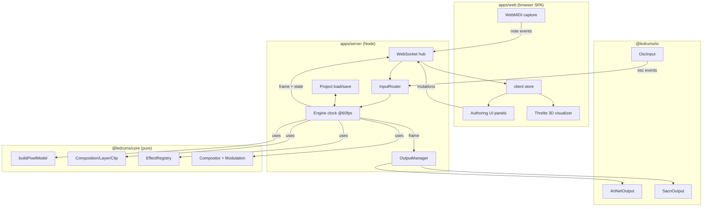
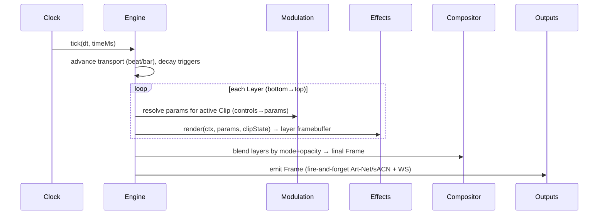

# feat: LEDrums Content App

## Summary

Build a cross-platform (Windows + macOS) real-time generative lighting engine and content-authoring app for a 3D LED-pixel drum kit. The app turns a drum-kit config into a per-pixel 3D model, composites authored **layers** (base / trigger / automation / effect) of **effects** at ~60fps, modulates effect **parameters** from live **controls** (drum velocity via MIDI, Ableton automation via OSC), outputs pixels over **Art-Net / sACN** to a hardware pixel controller (Advatek PixLite), and shows a live **Threlte 3D visualizer** plus authoring UI. The domain maps onto Resolume concepts: Composition → Layer → Clip (Pad) → Effect, with blend modes.

---

## Problem Frame

A drummer/lighting designer wants the lights on a physical LED drum kit to be tightly integrated with the music: "what you hear is what you see." Each drum is wrapped in stacked hoops of addressable LED pixels at known 3D positions. The designer needs to (a) describe the kit's geometry, (b) author generative lighting content as composable layers and effects, (c) drive and modulate that content live from drum hits (MIDI) and Ableton (OSC), (d) preview it faithfully in 3D before/while it plays on hardware, and (e) send it to the real fixtures over standard lighting protocols. No off-the-shelf tool models *3D pixel-mapped drums driven by drum performance*; Resolume is the closest mental model but is 2D-media-centric and not drum-aware.

This plan covers the full vertical slice end-to-end at MVP fidelity: geometry → engine → effects → modulation → IO (in and out) → visualizer → authoring UI → persistence, with an extensible effect registry so the long catalog in the design doc can grow over time.

---

## Requirements

Traced from `docs/design/content-design-source.md` (content) and `docs/design/hardware-source.md` (geometry/config).

- **R1 — Pixel model.** Build a 3D pixel model from a kit config: per drum, `hoopCount` hoops of pixels (count derived from circumference × LED density), each pixel carrying local + world XYZ, hoop index, angle, normalized height, and a drum **zone** (center/edge/rim/shell mapping per design "Drum Zones"). Honor per-drum `diameterIn`, `hoopSpacingMm`, `localSpinDeg`, `startAngleDeg`, `origin`, `rotation`, `effectOriginLocal`.
- **R2 — Layer model.** A Composition holds ordered layers; each layer has a blend mode, opacity, and a set of clips with one active clip (the "Pad"). (design: Layers = Base/Trigger/Automation/Effect; data model = Layer→Pad→Deck/Blending Mode/Effects.)
- **R3 — Effect registry.** A registry of effect generators, each a pure per-pixel renderer with typed parameters. MVP set must cover representative members of every design category: a base swirl, chase, whole-drum/whole-kit, follow-hoop (delay cascade), 3D radial wash (in/out/bounce), 3D wipe (any axis), meter/EQ, pixel-accumulation, colour-melody, strobe/flash.
- **R4 — Parameters.** Effects expose the design parameters where meaningful: Brightness, Saturation, Speed, Noise, Hue/Colour, Spacing, Delay Time, Delay Feedback.
- **R5 — Controls → modulation.** A modulation system binds control sources (Note Velocity, Note Speed, Volume, Drum Zone, Timbre, OSC/automation value, internal LFO, transport beat) to parameters with range + curve, resolved every frame.
- **R6 — MIDI input.** Drum hits arrive as MIDI note-on (note→drum mapping, velocity→control); captured in the browser via WebMIDI and forwarded to the engine. Note-on can trigger clips and feed velocity/zone controls.
- **R7 — OSC input.** Ableton/Max sends OSC over UDP; address patterns map to parameter values and clip triggers (design: "Ableton can trigger saved OSC patterns").
- **R8 — Pixel output.** Output the composited frame over Art-Net (ArtDmx) and/or sACN (E1.31) to a configurable controller IP. The pixel→(universe, channel) map is derived from an explicit **physical-output topology** (`outputs[]` with ≤304 px each and per-output patch order), not a flat pixel sweep, so universes land on the physically-wired pixels (design hardware: 304 px/output, multi-drum-per-output wiring, RGB order configurable).
- **R9 — Visualizer.** A live 3D view renders every pixel at its world position colored by the current frame, with orbit camera; updates from the engine's frame stream.
- **R10 — Authoring UI.** Edit the kit, layer stack, clip grid, effect parameters, modulation matrix, transport (BPM/play), and IO settings; monitor incoming MIDI/OSC.
- **R11 — Persistence.** Load/save projects (kit + composition + mappings) as portable JSON; ship a default project matching the real 4-drum kit (kick/snare/tom1/tom2) from the hardware doc.
- **R12 — Cross-platform.** Runs identically on Windows and macOS with `pnpm install` + `pnpm dev`; no native addons / node-gyp.
- **R13 — Replay determinism & safety.** The render loop is **replay-deterministic**: given an ordered, tick-stamped input log + model, it produces identical frames (the testable property). Live run-to-run reproducibility is *not* claimed — input arrival is async. Input events are stamped with arrival `timeMs` and drained at the start of each tick (events with `timeMs ≤ tickTime` apply that tick), giving a well-defined apply rule. Output is fire-and-forget and never stalls the clock.
- **R14 — Latency budget.** The product premise ("what you hear is what you see") requires a bounded hit→light latency. Target: trigger-driven effects respond within **≤2 frames** of event ingress; the engine instruments and can report end-to-end note-on→frame-emit latency. Trigger-mapped clips render at event time (drained at tick start) rather than waiting a full accumulator phase.
- **R15 — Output safety.** Output is an explicit state machine `disabled → dry-run → armed`, defaulting to **disabled**. Dry-run forms/counts packets without transmitting. On disconnect/send-error or disarm the engine emits a **blackout** (all channels 0) failsafe and surfaces the error without crashing the render loop. Default transport is unicast, not broadcast.

---

## Assumptions

Headless inferred bets (no synchronous user to confirm). Each is a reasonable default; all are reversible.

- **A1.** Pixel density default **120 px/m**, matching the shipped kit config (`ledDensityPxPerM: 120`) and the physical GS8208 strip pitch. Density is a property of the real hardware, not a free render knob, so we ship the true count and solve render performance with InstancedMesh + a throttled frame stream (feasibility review confirms ~2,300 instances @60fps is trivial; WS ~3.3 Mbit/s on LAN). Per-drum counts at 120 px/m: kick ≈ 800 px, snare/tom1 ≈ 460/460, tom2 ≈ 575; total ≈ 2,300 px. (Resolves the prior 60-vs-120 contradiction.)
- **A2.** Hoops are circles in each drum's local XY plane, stacked along local +Z (drum axis), spaced `hoopSpacingMm`; world position = local rotated by `rotation` then translated by `origin` (mm units, as in the config). `localSpinDeg`/`startAngleDeg` rotate the angular start of each hoop. **Euler order is pinned to Three.js intrinsic `XYZ`** so `core` and the visualizer agree by construction.
- **A3.** Default kit = the JSON in `docs/design/hardware-source.md` (kick/snare/tom1/tom2 with given origins/rotations), shipped as `apps/server/projects/default.json`. The hardware doc is internally inconsistent (prose header 22/13/13/16″ vs. JSON 21/12/12/15″); **the JSON config block is authoritative** — it is what the code consumes.
- **A4.** Drum zones derive from normalized hoop height plus angle. The design lists five zones (center/edge/rim-tip/rim-shoulder/shell); the physical kit wraps the shell, so MVP maps to four (`center`/`edge`/`rim`/`shell`, collapsing rim-tip+rim-shoulder → `rim`) from hoop-index ranges. Five-zone fidelity is deferred.
- **A5.** MVP transport is internal BPM clock (default 120) with tap-tempo; Ableton-link/MIDI-clock sync is deferred.
- **A6.** Output defaults to **disabled** (must be armed). When armed, **Art-Net unicast** to a configurable controller IP is the default/primary path (the documented PixLite target); sACN/E1.31 multicast is also shipped and selectable. Default RGB order `RGB` (GS8208 strips); configurable. Broadcast is opt-in, never default.
- **A7.** One browser tab is the control surface; MIDI requires a Chromium browser (WebMIDI) and a foreground/keep-alive guarded tab. OSC-only headless operation (no browser) is supported by the server. Live drum hits traverse browser→WS→engine; tab-throttle/focus loss is a named live-performance risk surfaced in the UI.
- **A8.** Physical output topology is modeled explicitly (see R8/U2): a kit declares `outputs[]`, each an ordered list of `(drumId, hoopRange)` segments with a **≤304 px/output** limit; `buildDmxMap` assigns universes along each output's patch order. The default project's output map mirrors the hardware doc wiring (kick+tom1 share an output via the routing daughter PCB; snare and tom2 on dedicated outputs; drums exceeding 304 px span multiple outputs).

---

## Key Technical Decisions

See `.mex/context/decisions.md` for the durable record. Plan-relevant decisions:

- **KTD1 — Pure `core`, IO at the edges.** `@ledrums/core` has zero Node/DOM imports; `@ledrums/io` holds UDP/Art-Net/sACN/OSC behind `PixelOutput`/`EventInput` interfaces; `@ledrums/server` wires them. Rationale: the render math and effects are the product and must be unit-testable and host-agnostic.
- **KTD2 — WebMIDI, not native MIDI.** Avoids node-gyp; cross-platform by construction (R12). Server stays MIDI-free; browser forwards events over WS.
- **KTD3 — Hand-rolled protocol encoders.** Art-Net/sACN/OSC encoded over `node:dgram`; byte-level unit tests. No protocol npm deps.
- **KTD4 — Static SPA + Node server, one process.** Svelte 5 + Vite SPA built to static assets served by the server alongside the WS endpoint. `pnpm start` runs everything.
- **KTD5 — Fixed-timestep engine.** Default 60fps deterministic clock; effects receive `dt`, absolute `timeMs`, and derived transport (beat/bar). Output transmission decoupled and throttled.
- **KTD6 — Framebuffer model.** Each layer renders into a flat `Float32Array` RGBA framebuffer indexed by pixel id; the compositor blends bottom→top into a final `Uint8` RGB frame. Float internally for clean blending/HDR-ish headroom, quantized once at output.
- **KTD7 — Effects are pure functions of `RenderContext`.** No effect holds wall-clock or RNG state outside seeded, context-provided helpers; per-clip mutable runtime state (e.g., accumulation buffers, active "hogs") lives in an explicit `ClipState` the engine owns and passes in — keeps determinism (R13) while allowing stateful effects.

---

## High-Level Technical Design

### Component & data flow



### Render pipeline (per frame)



### Pixel addressing

`buildPixelModel(kit)` yields `Pixel[]` in a stable order grouped by drum then hoop then angular index. A separate `buildDmxMap(kit, outputs)` assigns each pixel a `(universe, channelStart)` given channels-per-pixel (3 for RGB) and a per-output pixel budget (default 170 px/universe = 510 ch ≤ 512), mirroring the hardware's per-output pixel limits.

---

## Output Structure

```
ledrums/
├── package.json                 # workspace root, scripts (dev/build/test/start)
├── pnpm-workspace.yaml
├── tsconfig.base.json
├── CLAUDE.md                    # mex anchor
├── .mex/                        # repo documentation scaffold (architecture/stack/decisions)
├── docs/
│   ├── design/                  # imported source design + hardware docs
│   └── plans/
├── packages/
│   ├── core/                    # pure engine
│   │   └── src/
│   │       ├── geometry/        # kit schema, buildPixelModel, dmx map, zones
│   │       ├── color/           # rgb/hsv, blend modes
│   │       ├── model/           # composition/layer/clip/modulation types + defaults
│   │       ├── effects/         # registry + effect implementations
│   │       ├── engine/          # render context, compositor, modulation resolver, engine state
│   │       └── index.ts
│   └── io/                      # pure-JS UDP adapters
│       └── src/
│           ├── artnet.ts  sacn.ts  osc.ts  interfaces.ts  index.ts
├── apps/
│   ├── server/                  # Node host
│   │   ├── src/{engine-host,ws-protocol,input-router,output-manager,projects,main}.ts
│   │   └── projects/default.json
│   └── web/                     # Svelte 5 + Vite SPA
│       └── src/{lib/{ws,midi,store,visualizer,panels},App.svelte,main.ts}
└── README.md
```

---

## Scope Boundaries

**In scope:** everything in R1–R13 at MVP fidelity — pixel model, layer/clip model, ~10 effects across all categories, parameter+modulation system, MIDI(WebMIDI)+OSC input, Art-Net+sACN output, 3D visualizer, authoring UI, JSON persistence, default kit, cross-platform run, tests + typecheck + build green.

### Deferred to Follow-Up Work
- Electron/Tauri desktop packaging (the SPA+server already runs cross-platform; a shell is a later convenience).
- Ableton Link / MIDI-clock sync (internal BPM clock for MVP).
- The full long-tail effect catalog (Sacred Hogs, Collisions, Riser, 3D Shape) — registry makes these additive; MVP ships representatives of each category.
- Gamified modes (Drum Hero, Training Aid, Virtual Concert) — design "Other things you can do," out of MVP.
- Power/wiring calculators from the hardware doc.

### Outside this product's identity
- A general DMX lighting console / Resolume clone. This is drum-kit-pixel-native.
- Physically-accurate light-spill simulation.
- Cloud sync / multi-user collaboration.

---

## Implementation Units

### U1. Workspace tooling & package manifests
**Goal:** Establish the four workspace packages so everything else compiles and tests run.
**Requirements:** R12.
**Dependencies:** none.
**Files:** `packages/core/package.json`, `packages/core/tsconfig.json`, `packages/io/package.json`, `packages/io/tsconfig.json`, `apps/server/package.json`, `apps/server/tsconfig.json`, `apps/web/package.json`, `apps/web/tsconfig.json`, `apps/web/vite.config.ts`, `apps/web/svelte.config.js`, root scripts already in `package.json`.
**Approach:** ESM, TS project refs off `tsconfig.base.json`. `core` and `io` build with `tsc`; `web` with Vite; `server` with `tsc` + tsx for dev. Wire `test`/`typecheck`/`build`/`dev` scripts per package. Cross-platform scripts only (no shell-isms).
**Patterns to follow:** root `package.json` script style already present.
**Test scenarios:** `Test expectation: none -- scaffolding`; verification is that `pnpm install && pnpm -r typecheck` succeeds.
**Verification:** `pnpm install` resolves; `pnpm typecheck` passes on empty stubs.

### U2. Kit geometry & pixel model (`core/geometry`)
**Goal:** Turn a validated kit config into the ordered `Pixel[]` 3D model + DMX map + zones.
**Requirements:** R1, R8(map).
**Dependencies:** U1.
**Files:** `packages/core/src/geometry/kit-schema.ts` (zod, incl. `outputs[]` topology), `packages/core/src/geometry/pixel-model.ts`, `packages/core/src/geometry/dmx-map.ts`, `packages/core/src/geometry/zones.ts`, `packages/core/src/geometry/euler.ts`, `packages/core/src/geometry/pixel-model.test.ts`, `packages/core/src/geometry/dmx-map.test.ts`.
**Approach:** `buildPixelModel(kit)`: for each drum, compute circumference from `diameterIn`→mm, pixels/hoop = round(circumference_m × density), distribute pixels around the circle starting at `startAngleDeg`+`localSpinDeg`, stack hoops along local +Z by `hoopSpacingMm`; transform local→world via `rotation` using **intrinsic Three.js `XYZ` Euler order** (`euler.ts`, degrees) then `origin`. Emit per-pixel metadata (drumId, hoopIndex, indexInHoop, angleDeg, normHoop, zone, local{x,y,z}, world{x,y,z}). `buildDmxMap(kit)` walks the kit's `outputs[]` topology — each output is an ordered list of `(drumId, hoopRange)` segments, ≤304 px — and assigns (universe, channelStart) along each output's patch order (channels/pixel configurable, ≤170 px/universe). `zones.ts` classifies pixels into center/edge/rim/shell from hoop-index ranges.
**Technical design (directional):** world = `translate(origin) ∘ eulerXYZ(rotation) ∘ (localXY on circle, localZ = hoopIndex*spacing)`. The DMX map is output-major, not pixel-id-major, so it mirrors physical wiring.
**Test scenarios:**
- Happy: a 1-drum, 2-hoop kit yields `2 × pixelsPerHoop` pixels; pixel count matches `round(π·d_m·density)·hoops`.
- Geometry: hoop-0 pixels lie on a circle of correct radius in local space; world transform with `origin={x:100}` shifts all world.x by +100.
- Euler order: a **compound** rotation (e.g. tom1 `x:165,z:4`) matches a Three.js `Euler('XYZ')` reference vector within epsilon (single-axis tests can't detect order mismatch).
- Angles: first pixel angle == `startAngleDeg`+`localSpinDeg` (mod 360); angles increase by 360/pixelsPerHoop.
- DMX map: pixels are assigned in output patch order; with 3 ch/px the 171st pixel on an output starts the next universe at channel 0; channelStart always ≤ 509; an output is laid out before the next output's universes begin.
- Topology validation: schema rejects an output whose summed segment pixels exceed 304, a segment referencing an unknown drum/hoop, and a kit missing `hoopCount` or with negative diameter — each with a clear error.
- Zones: lowest hoop classified shell-side vs highest per the mapping; every pixel gets exactly one zone.
**Verification:** geometry tests green; the default kit reports the expected ~2,300 total pixels and a valid output map (logged), with no output > 304 px.

### U3. Color & blend modes (`core/color`)
**Goal:** Color primitives and blend functions the compositor and effects share.
**Requirements:** R2(blend), R4(hue/sat/brightness).
**Dependencies:** U1.
**Files:** `packages/core/src/color/color.ts` (rgb↔hsv, clamp, gamma helpers), `packages/core/src/color/blend.ts` (normal/add/screen/multiply/lighten/max), `packages/core/src/color/blend.test.ts`, `packages/core/src/color/color.test.ts`.
**Approach:** Work in normalized float RGBA. Blend signature `(dst, src, opacity) → dst`. HSV used by hue/colour-melody effects.
**Test scenarios:**
- hsv→rgb→hsv round-trips within epsilon for representative hues; hue=0 sat=1 val=1 → red.
- add blend of (0.6)+(0.6) clamps to 1.0; multiply of (1.0,0.5)→0.5; screen ≥ both inputs; opacity 0 leaves dst unchanged; opacity 1 normal == src.
**Verification:** color tests green.

### U4. Composition / layer / clip / modulation model (`core/model`)
**Goal:** Serializable domain types + defaults + validation; the shape persisted as a project.
**Requirements:** R2, R4, R5, R11.
**Dependencies:** U1.
**Files:** `packages/core/src/model/types.ts`, `packages/core/src/model/defaults.ts`, `packages/core/src/model/project-schema.ts` (zod), `packages/core/src/model/project-schema.test.ts`.
**Approach:** `Project = { kit, composition, inputMap, output }`. `Composition = { layers: Layer[], transport }`. `Layer = { id, name, blendMode, opacity, clips: Clip[], activeClipId, role }`. `Clip = { id, name, effectId, params: Record<string,number|string>, modulations: Modulation[] }`. `Modulation = { source: ControlSource, param, min, max, curve }`. **MVP `ControlSource`** = `velocity | volume | beat | lfo(rate,shape) | osc(address)` — every source has a shipping consumer. `timbre` and `noteSpeed` are deferred (no MVP input path; design defines timbre only vaguely). `output` carries `{ state, protocol, host, rgbOrder, ... }` per R15. Provide `defaultProject()` builder.
**Test scenarios:**
- A round-trip: `projectSchema.parse(serialize(defaultProject()))` deep-equals the input.
- Rejects unknown blend mode and out-of-range opacity; accepts a clip with zero modulations.
- `defaultProject()` has ≥1 base layer + ≥1 trigger layer and a valid transport.
**Verification:** schema tests green; default project validates.

### U5. Render context, framebuffer, effect registry + effects (`core/effects`)
**Goal:** The effect abstraction and the MVP effect catalog.
**Requirements:** R3, R4, R7(osc-driven params via modulation), R13.
**Dependencies:** U2, U3, U4.
**Files:** `packages/core/src/engine/render-context.ts`, `packages/core/src/engine/framebuffer.ts`, `packages/core/src/effects/registry.ts`, `packages/core/src/effects/types.ts`, one file per effect under `packages/core/src/effects/impl/` (`solid-base.ts`, `chase.ts`, `whole-drum.ts`, `whole-kit.ts`, `follow-hoop.ts`, `radial-wash.ts`, `wipe-3d.ts`, `meter-eq.ts`, `pixel-accum.ts`, `colour-melody.ts`, `strobe.ts`), `packages/core/src/effects/registry.test.ts`, `packages/core/src/effects/effects.test.ts`.
**Approach:** `EffectGenerator = { id, name, category, paramSpec, defaultState?, render(ctx, params, fb, state) }`. `RenderContext` carries `model` (pixels), `timeMs`, `dt`, `transport`, `triggers` (recent hits w/ drum, velocity, ageMs), `noise` (seeded), `rng` (seeded). `paramSpec` declares params with type/min/max/default so the UI can render controls generically. Registry maps id→generator. Effects write RGBA into `fb`. Stateful effects (pixel-accum, follow-hoop delay buffer) use `state` owned by the engine.
**Technical design (directional):** `radial-wash` colors pixel by `f(dist(pixel.world, effectOrigin) − waveRadius(t))`; `wipe-3d` by signed distance to a moving plane with configurable axis; `meter-eq` lights hoops up to a level derived from a control; `chase` selects active hoop = `floor(beat*subdiv) % hoops`; `colour-melody` maps MIDI note 0–127 linearly to HSV hue 0–360°, holds the last color until the next note, and scales value by velocity. Stateful effects (`pixel-accum`, `follow-hoop`) receive an engine-owned `state`; the engine **resets `state` on clip change** and never persists it (session-scoped). The seeded RNG cursor lives in `state`; the seed is derived from `clipId` so two engines fed the same event log match.
**Test scenarios:**
- Registry: every effect id is unique; `paramSpec` defaults are within declared min/max; `getEffect(id)` returns generator; unknown id throws.
- solid-base: with brightness=1 every pixel non-black; brightness=0 → all black.
- chase: at beat boundaries the lit hoop index advances and wraps; only one hoop group lit per drum.
- whole-drum vs whole-kit: whole-drum lights all pixels of triggered drum only; whole-kit lights all pixels.
- follow-hoop: a trigger at t lights hoop0 now and hoop1 after `delayMs` (assert framebuffer at two times).
- radial-wash in vs out: at increasing t the lit shell moves outward (out) / inward (in); bounce reverses past midpoint.
- wipe-3d: plane at axis=x sweeps; pixels with world.x < plane lit before those with greater x.
- meter-eq: level control 0 → no hoops lit; 1 → all hoops lit; 0.5 → ~half (monotonic in level).
- pixel-accum: N triggers light ≤ N new pixels deterministically given seeded rng; determinism across two runs with same seed.
- colour-melody: note number maps to distinct hue; same note → same hue.
- strobe: on-phase all-on, off-phase all-off at configured rate.
- Determinism: rendering the same context twice yields identical framebuffers (R13).
**Verification:** effects + registry tests green; each effect renders without NaN/out-of-range values.

### U6. Compositor, modulation resolver & engine state (`core/engine`)
**Goal:** Resolve controls→params, render all layers, blend to a final frame; own per-clip runtime state and transport advance.
**Requirements:** R2, R5, R6(velocity/zone control values), R13.
**Dependencies:** U5.
**Files:** `packages/core/src/engine/modulation.ts`, `packages/core/src/engine/compositor.ts`, `packages/core/src/engine/engine.ts`, `packages/core/src/engine/transport.ts`, `packages/core/src/engine/control-state.ts`, plus `*.test.ts` siblings, and `packages/core/src/index.ts` barrel.
**Approach:** `ControlState` holds latest control values (velocity per drum, volume, osc values by address, lfo phases, beat) updated from input events + clock. `resolveParams(clip, controlState, ctx)` applies each modulation: `value = lerp(min,max, curve(sourceValue))` overlaid on base params. `Engine` owns `Project`, `ClipState` map, transport, and a **time-stamped input queue**: `applyEvent(InputEvent)` enqueues (events carry arrival `timeMs`); `engine.tick(dt)` first drains all events with `timeMs ≤ tickTime` (defined apply order → R13/R14), then advances transport, decays triggers, renders each layer's active clip into a pooled framebuffer, composites bottom→top → `Frame`. `ClipState` is reset on `activeClipId` change and on engine init. The engine records the wall-time of the most recent trigger ingress and its first-emit so latency (R14) can be reported. Engine exposes `getFrame()` and `getStats()`.
**Test scenarios:**
- Modulation: velocity 0→param=min, 127→param=max with linear curve; exp curve is monotonic; missing source defaults to base param.
- Compositor: 2 layers, top normal opacity 1 fully covers; opacity 0 shows bottom; add mode brightens.
- Engine: a note-on event raises that drum's velocity control then decays over time; `tick` is pure given same inputs (two engines fed identical events produce identical frames — R13).
- Transport: at 120 BPM, beat advances 1.0 per 500ms; bar wraps every 4 beats.
- Triggered clip: a trigger-mapped note activates the mapped clip for its duration then releases.
**Verification:** engine tests green; full-kit tick under budget (assert tick time for default kit is well under 16ms in a perf smoke test).

### U7. IO adapters (`packages/io`)
**Goal:** Pure-JS Art-Net + sACN output and OSC input/parse behind interfaces.
**Requirements:** R7, R8, R12.
**Dependencies:** U1 (encoders are byte-pure; depend only on Node `dgram` at send time).
**Files:** `packages/io/src/interfaces.ts` (`PixelOutput`, `EventInput`), `packages/io/src/artnet.ts`, `packages/io/src/sacn.ts`, `packages/io/src/osc.ts`, `packages/io/src/index.ts`, `packages/io/src/artnet.test.ts`, `packages/io/src/sacn.test.ts`, `packages/io/src/osc.test.ts`.
**Approach:** Split each protocol into a pure `encode*()`/`decode*()` (no sockets, fully testable) and a thin `dgram` sender/receiver. `ArtNetOutput` builds ArtDmx (header `Art-Net\0`, opcode 0x5000, protocol 14, **per-frame sequence counter shared across universes**, physical, universe LE, **length BE = the universe's channel count, even-padded**; partial final universes zero-padded to their true even length). `SacnOutput` builds E1.31 root (vector 0x4) + framing (vector 0x2, universe) + DMP (vector 0x2, property count 513 incl. start code) layers with a stable CID. Both senders take **network config**: target host, unicast (default) vs broadcast (explicit `broadcast` socket flag) vs sACN multicast with an **outbound interface override** (macOS/Windows multi-NIC safety). `OscInput` binds a UDP port (interface-configurable) and parses OSC messages (address, typetags, int32/float32/string/blob, big-endian, 4-byte aligned) into `EventInput` events; a small `encodeOsc` helper backs round-trip tests.
**Test scenarios:**
- Art-Net: encoded packet starts with `Art-Net\0`, opcode bytes `0x00 0x50`, universe little-endian, length big-endian == data length; 512-channel frame length correct.
- sACN: root vector = 0x00000004, framing vector = 0x00000002, DMP vector = 0x02, universe in framing layer matches, property count = 513 (start code + 512).
- OSC: `encodeOsc('/x', [1, 2.5, 'hi'])` round-trips through `parseOsc`; address + typetag string are 4-byte aligned and null-terminated; float/int byte order big-endian; malformed packet returns null/throws cleanly.
**Verification:** byte-level encoder tests green; no third-party protocol deps in `packages/io`.

### U8. Server: engine host, WS protocol, input router, output manager, persistence
**Goal:** Run the engine on a clock, stream frames+state over WS, route inputs, drive outputs, load/save projects, serve the web build.
**Requirements:** R6, R7, R8, R9(stream), R10(mutations), R11, R13.
**Dependencies:** U6, U7.
**Files:** `apps/server/src/engine-host.ts`, `apps/server/src/ws-protocol.ts`, `apps/server/src/input-router.ts`, `apps/server/src/output-manager.ts`, `apps/server/src/projects.ts`, `apps/server/src/static-host.ts`, `apps/server/src/main.ts`, `apps/server/projects/default.json`, `apps/server/src/ws-protocol.test.ts`, `apps/server/src/input-router.test.ts`, `apps/server/src/projects.test.ts`.
**Approach:** `engine-host` runs a `setInterval`/`setTimeout` fixed-timestep loop (target 60fps, accumulator) calling `engine.tick`. `ws-protocol` defines a small **typed** message union both directions — no generic path-mutation. Client→server: `{midi}`, `{osc}` (loopback/test), `{setParam:{clipId,key,value}}`, `{setLayer:{layerId,blendMode?,opacity?,activeClipId?}}`, `{addLayer|removeLayer|addClip|removeClip}`, `{setTransport}`, `{setKitTransform:{drumId,...}}`, `{setOutput:{state,protocol,host,...}}`, `{loadProject}`, `{saveProject}`. Server→client: `{state}` (full project, sent on structural changes only), `{frame}` (binary pixel RGB, throttled ~30–60fps), `{input}` (monitor echo), `{stats}` (latency/fps/output-state). Each message type round-trips through encode/decode and applies via a typed reducer. `input-router` converts WS midi + `OscInput` osc into time-stamped engine `InputEvent`s using the project's `inputMap`. `output-manager` is the R15 state machine (`disabled→dry-run→armed`): owns Art-Net/sACN instances, maps `Frame`→universes via the **output-topology DMX map**, sends fire-and-forget at output rate when armed, forms-without-sending in dry-run, and emits a **blackout** on disarm/disconnect/error. `projects` reads/writes JSON under `apps/server/projects/`, validated by the core schema. `static-host` serves `apps/web/dist`. `main` wires it all, binds a **shared `WS_PORT`/`WS_PATH` constant** (also referenced by the Vite proxy), and prints the LAN URL.
**Execution note:** Start with a failing test for the WS message contract (encode/decode round-trip) before wiring sockets.
**Test scenarios:**
- WS protocol: every client and server message type round-trips through encode/decode; unknown type is rejected; binary frame message decodes to the right pixel count.
- Typed reducer: `setParam` updates only the targeted clip param; `setLayer` opacity/blendMode/activeClipId apply; `addLayer`/`removeClip` mutate structure and trigger a `{state}` echo; an out-of-range value is clamped/rejected, not applied blindly.
- Input router: a midi note-on for a mapped drum produces a trigger+velocity engine event stamped with arrival time; an OSC `/param/brightness 0.5` sets the mapped control; unmapped input is ignored without throwing.
- Output state machine: `disabled` emits nothing (inject a fake `PixelOutput`, assert zero sends); `dry-run` forms packets/counts but does not send; `armed` sends; transitioning armed→disabled and a simulated send-error both emit a blackout (all-zero) final frame.
- Output mapping: a known Frame maps to expected (universe→bytes) via the default output topology without opening a socket.
- Projects: save then load returns an equal project; loading invalid JSON surfaces a validation error, not a crash; default.json validates against the schema and its output map has no output > 304 px.
**Verification:** server tests green; `pnpm --filter @ledrums/server typecheck` passes; manual `tsx main.ts` boots, loads default project, and logs a stable tick rate.

### U9. Web: client store, WS client, WebMIDI, Threlte 3D visualizer
**Goal:** Connect to the server, capture MIDI, and render the live pixels in 3D.
**Requirements:** R6, R9, R12.
**Dependencies:** U8 (protocol), U2 (pixel positions arrive in state).
**Files:** `apps/web/src/lib/ws/client.ts`, `apps/web/src/lib/midi/webmidi.ts`, `apps/web/src/lib/store/app-store.svelte.ts`, `apps/web/src/lib/visualizer/Scene.svelte`, `apps/web/src/lib/visualizer/Pixels.svelte`, `apps/web/src/App.svelte`, `apps/web/src/main.ts`, `apps/web/index.html`, `apps/web/src/lib/ws/client.test.ts`, `apps/web/src/lib/midi/webmidi.test.ts`.
**Approach:** `client.ts` wraps WS with reconnect, decodes server messages, exposes typed callbacks. `app-store.svelte.ts` holds project state + latest frame (runes). `webmidi.ts` requests MIDI access, enumerates inputs, forwards note-on/off as WS midi messages; guarded for browsers without WebMIDI. `Pixels.svelte` uses a Threlte `InstancedMesh` (one instance per pixel at world position; instance color updated each frame from the binary frame buffer). `Scene.svelte` adds orbit controls, grid, and per-drum origin gizmos. Units: mm→scene scale factor.
**Test scenarios (logic-level; Threlte components verified by build + manual):**
- WS client: decodes a `state` and a binary `frame` message and invokes the right callback; auto-reconnect schedules on close; malformed message ignored.
- WebMIDI: a fake MIDIAccess with one input + a note-on yields one forwarded WS midi message with correct note/velocity; absence of `navigator.requestMIDIAccess` degrades gracefully (no throw, surfaced flag).
- Store: applying a `frame` updates the reactive color array length == pixel count.
**Verification:** `pnpm --filter @ledrums/web build` succeeds; visualizer renders the default kit and updates colors when the server streams frames (manual).

### U10. Web: authoring UI panels
**Goal:** Edit kit, layers, clips, params, modulation, transport, IO; monitor inputs.
**Requirements:** R4, R5, R10.
**Dependencies:** U9.
**Files:** `apps/web/src/lib/panels/LayerStack.svelte`, `ClipGrid.svelte`, `EffectParams.svelte`, `ModulationMatrix.svelte`, `Transport.svelte`, `OutputConfig.svelte`, `KitEditor.svelte`, `InputMonitor.svelte`, `ProjectBar.svelte`, `StatusBar.svelte`, `apps/web/src/lib/panels/params.ts` (+ `params.test.ts`), and the layout in `App.svelte`.
**Approach — layout & hierarchy (resolves design-review AI-slop risk):** the **3D visualizer is the primary, always-full-bleed surface**; panels live in a **collapsible right dock** + a persistent top `ProjectBar` and bottom/overlay `StatusBar` — *not* an equal-weight card grid. A **mode toggle** switches **Performance** (always-on: Transport, LayerStack, ClipGrid, StatusBar; visualizer dominant) vs **Authoring** (adds ModulationMatrix, OutputConfig, KitEditor). `StatusBar` shows always-visible **WS state** (connecting/connected/retrying+attempt), **MIDI state** (active/unavailable/no-access), and **Output state** (off/dry-run/live/error) — when WS drops the visualizer dims with an overlay rather than showing stale frames.
**Approach — interaction:** generic param controls render from each effect's `paramSpec` via `params.ts` (number→slider, color→swatch, enum→select). Sliders dispatch `setParam` on `input`, **throttled ~30/s leading-edge**, and apply **optimistically** in the store before the server echo; the server echoes full `{state}` only on structural change (avoids echo-flooding during performance). `Transport` has **tap-tempo** (≥4 taps, debounced), a beat-pulse indicator, BPM nudge, and play/stop. `ClipGrid` empty state shows "Add Clip / Choose Effect"; `LayerStack` empty shows "Add Layer"; `EffectParams` shows a placeholder when no clip is selected. `InputMonitor` is a **per-drum hit-indicator** (cells flash with velocity-mapped brightness; MIDI vs OSC distinguished) plus a short rolling tail — not an unbounded log. `OutputConfig` exposes the arm/dry-run/live control and surfaces send errors. `KitEditor` edits drum **transforms only** (origin/rotation/spin/startAngle → geometry rebuild via `setKitTransform`); structural changes (hoopCount/density) remain file+restart. Every edit sends a **typed** WS message; the server is source of truth.
**Test scenarios:** `Test expectation: none -- presentational`, except logic tests in `params.test.ts`: `paramSpec`→control descriptor yields the right control type per param type; the slider throttle dispatches a leading-edge event immediately and coalesces a burst into ≤ expected count; tap-tempo computes BPM from tap intervals.
**Verification:** UI builds; the mode toggle and dock collapse work; editing a parameter optimistically updates the visualizer with no echo flood; status bar reflects WS/MIDI/output state transitions; loading/saving a project works end-to-end (manual).

### U11. Integration, default project, run scripts & docs
**Goal:** Wire the whole app together, ship the real default kit, make `pnpm dev`/`start` work on Win+Mac, and document it.
**Requirements:** R3, R11, R12.
**Dependencies:** U8, U9, U10.
**Files:** `apps/server/projects/default.json` (finalized from hardware-source kit + a starter composition using several effects + sample MIDI/OSC maps), root `README.md`, `apps/web` proxy config for dev, `.mex/context/setup.md` + `.mex/context/conventions.md` populated, a `mex log` entry.
**Approach:** Compose a starter composition: a base swirl layer (always-on, driven by an LFO), a trigger layer with chase + whole-drum mapped to drum notes, an effect layer with a radial-wash, plus modulations (velocity→brightness, volume→saturation). Ship the **default output topology** matching the hardware doc (kick+tom1 shared output, snare/tom2 dedicated, kick/tom split across outputs to respect ≤304 px). Default input map: GM-ish drum notes → kick/snare/tom1/tom2; a few OSC addresses → params. Dev: Vite dev server proxies `{ '/ws': { target: <WS_PORT>, ws: true } }` to the Node server using the **shared `WS_PORT`/`WS_PATH` constant**; `pnpm dev` runs both in parallel and the WS client's reconnect tolerates the server-not-yet-bound startup race. `start`: build web, server serves `dist`. README documents Windows + macOS setup, the **Windows Defender Firewall inbound-UDP prompt** (must allow for OSC), output arming/dry-run, hardware wiring (link to design), and OSC/MIDI mapping. A short manual **cross-OS smoke checklist** (send to a sniffer/real controller on both OSes) is included as a verification aid.
**Test scenarios:** `Test expectation: none -- integration/config`; verification is the green full-suite + manual end-to-end.
**Verification:** `pnpm install && pnpm test && pnpm typecheck && pnpm build` all green; `pnpm dev` opens a working app that visualizes the default kit and reacts to simulated input; output packets observed on the wire (or via a loopback capture) when an output target is configured.

---

## Risks & Dependencies

- **Hit→light latency** (the core premise). Mitigation: R14 budget + engine instrumentation; trigger events apply at tick-start drain (≤2 frames); report end-to-end latency in `{stats}`.
- **DMX topology vs. physical wiring.** The PixLite binds *physical outputs* (≤304 px), and one output spans two drums. Mitigation: explicit `outputs[]` topology (A8/R8/U2), ≤304 px validation, default map mirrors the wiring; the visualizer alone can't catch this, so the topology is schema-validated and unit-tested.
- **Performance at high pixel counts.** Mitigation: float framebuffer pooling, InstancedMesh, throttled WS frame stream independent of engine rate, per-frame budget asserted in U6 (~2,300 px is comfortably within budget).
- **WebMIDI fragility on the live path.** Chromium-only, and tab throttle/focus loss drops hits mid-set. Mitigation: feature-detect + loud status surfacing + keep-alive (A7); OSC path keeps the app useful without MIDI; server-side native-MIDI fallback is an additive follow-up behind the `EventInput` interface.
- **Output safety on real hardware** (12V / 7A per output). Mitigation: R15 state machine defaults to disabled, real tested dry-run, unicast default (broadcast opt-in), blackout failsafe on error/disarm.
- **Protocol correctness (Art-Net/sACN).** Hand-rolled. Mitigation: byte-level unit tests against published layouts (even length, per-frame sequence, E1.31 vectors/property-count); manual known-good capture check in the cross-OS smoke.
- **Cross-platform UDP** (multicast interface selection, broadcast flag, Windows firewall). Mitigation: configurable bind/interface, documented firewall step, cross-OS smoke checklist (U11).
- **Coordinate/rotation mismatches** vs. the physical kit. Mitigation: Euler order pinned to Three.js `XYZ` (A2) so core+visualizer agree; compound-rotation test (U2); KitEditor corrects transforms live.
- **Scope.** The effect catalog is large. Mitigation: registry-driven; MVP ships category representatives; the rest are additive follow-ups.

---

## Sources & Research

- `docs/design/content-design-source.md` — layers, effects catalog, controls, parameters, transitions, Resolume mapping.
- `docs/design/hardware-source.md` — drum dimensions, kit config JSON (the default kit), pixel/output limits, wiring, power.
- `.mex/context/architecture.md`, `.mex/context/stack.md`, `.mex/context/decisions.md` — the durable architecture record this plan implements.
- Protocol references (encoders implemented to spec): Art-Net 4 ArtDmx, ANSI E1.31 (sACN), OSC 1.0. No external research subagents were dispatched — the architecture was settled pre-plan and the repo is greenfield (no local patterns to mine).

### Review Resolutions (ce-doc-review round 1, 2026-06-20)

Five reviewer personas (coherence, feasibility, adversarial, scope-guardian, design-lens) reviewed this plan. Load-bearing findings folded into the doc above:

- **DMX output topology** (feasibility + adversarial, cross-persona) → explicit `outputs[]` with ≤304 px/output and shared-output wiring; `buildDmxMap` is output-major (A8, R8, U2, U8).
- **Density 60↔120 contradiction** (coherence + feasibility + adversarial) → pinned to 120 (hardware truth); render perf via instancing (A1).
- **Determinism overclaim** (feasibility + adversarial) → reframed to replay-determinism with a tick-stamped input queue (R13, U6).
- **No latency budget** (adversarial) → added R14 + engine instrumentation; event-time trigger apply.
- **Phantom dry-run / output safety** (adversarial + design) → added R15 state machine, unicast default, blackout failsafe (U7, U8, U10).
- **Speculative modulation sources** (scope + adversarial) → trimmed MVP `ControlSource` to velocity/volume/beat/lfo/osc; deferred timbre/noteSpeed (U4).
- **Under-specified UI** (design) → layout/mode/status/empty-state/interaction decisions added; AI-slop equal-weight-dashboard risk addressed (U10).
- **Adopted minor:** typed mutation messages over generic path-mutation (U8); Euler order pinned `XYZ` (A2, U2); Art-Net length/sequence + cross-platform UDP/firewall (U7, U11); ClipState session-scoped reset-on-clip-change (U5, U6); colour-melody spec + `solid-base` naming (U5); hardware JSON authoritative + 5→4 zone collapse documented (A3, A4).
- **Considered, kept as-is (with rationale):** both Art-Net + sACN encoders retained — cheap, fully tested, user asked for a full build (Art-Net is default/primary); `KitEditor` retained but scoped to transforms (supports live calibration, the plan's own visualizer-as-ground-truth mitigation).
